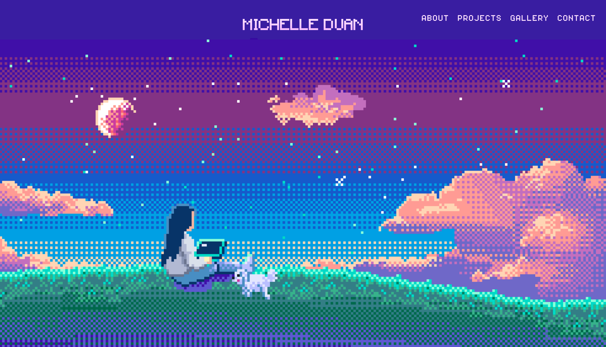
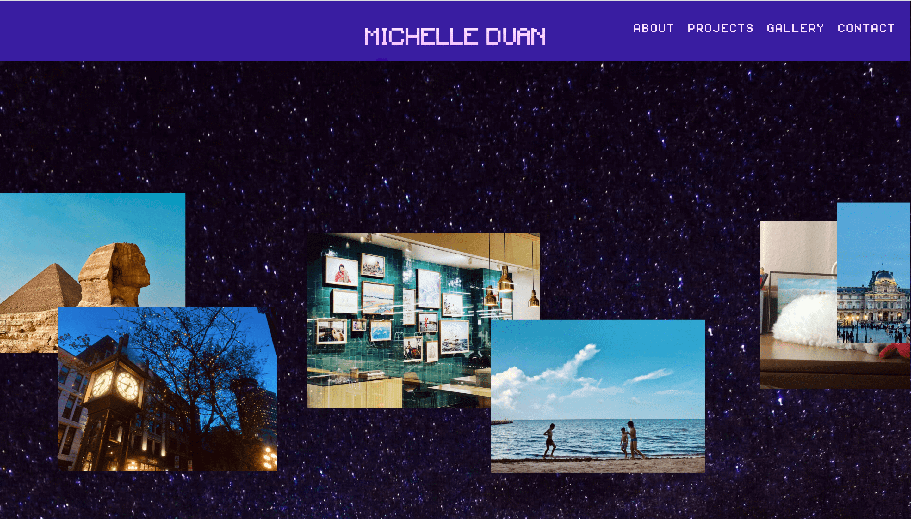

# michelle-duan.github.io

By: Michelle Duan

For CS 5610
https://johnguerra.co/classes/webDevelopment_fall_2020/

Project Objective: 
100% pixel art styled cute personal website that showcase my info, selected projects, gallery and way to contact.

Screenshot:

Instructions to build:
Just click index.html to access the homepage

References:
https://codepen.io/pehaa/pen/zYxbxQg
http://michellephan.com

Demo Video:
https://youtu.be/rWarDqr6OVY
